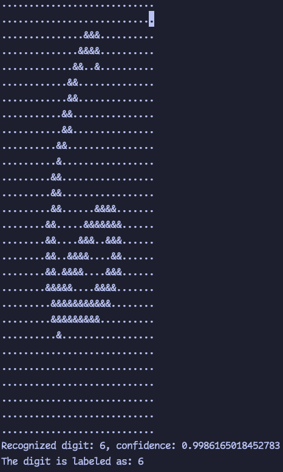

# nn-rs

Yet another neural network implementation in rust

Here is the [live demo](https://www.driedyellowpeach.us/playground/canvas)

## Some output examples

|            Examples             |
| :-----------------------------: |
|  |
|  |
|  |
